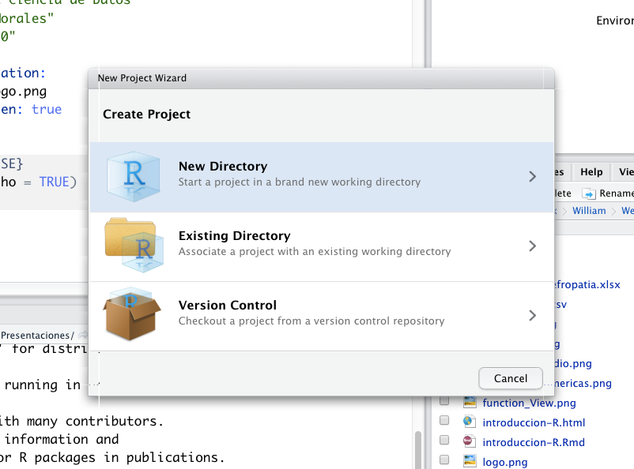

```{r setup, include=FALSE}
knitr::opts_chunk$set(echo = TRUE)
```

<style>
div.footnotes {
  position: absolute;
  bottom: 20px;
  margin-bottom: 40px;
  width: 80%;
  font-size: 0.6em;
}
</style>

<script src="https://ajax.googleapis.com/ajax/libs/jquery/3.1.1/jquery.min.js"></script>

<script>
  $(document).ready(function() {
    $('slide:not(.backdrop):not(.title-slide)').append('<div class=\"footnotes\">');

    $('footnote').each(function(index) {
      var text  = $(this).html();
      var fnNum = (index+1).toString().sup();
      $(this).html(text + fnNum);

      var footnote   = fnNum + ': ' + $(this).attr('content') + '<br/>';
      var oldContent = $(this).parents('slide').children('div.footnotes').html();
      var newContent = oldContent + footnote;
      $(this).parents('slide').children('div.footnotes').html(newContent);
    });
  });
</script>


## ¿Quien soy?

<div class="columns-2">
```{r foto_william, echo=FALSE, out.width = '70%', out.height = '90%', fig.align='right'}

```

  - William Hoyos
  - Estudiante doctoral (EAFIT)
  - Intereses:
      + Predicción de Enfermedades con Inteligencia Artificial
  - Contacto:
      + wshoyosm@eafit.edu.co
      + Twitter: @whoyos21
</div>


## Contenido

### - Historia de R
### - Descarga e Instalación
### - Paquetes de R
### - La Calculadora
### - Estructuras de Datos
### - Importar Datos


# Historia de R

## Historia de R <footnote content="https://es.wikipedia.org/wiki/R_(lenguaje_de_programaci%C3%B3n)"></footnote>
- Desarrollado inicialmente por Robert Gentleman y Ross Ihaka
- Departamento de Estadística de la Universidad de Auckland en 1993
- IBM (Lenguaje S)
- *R Development Core Team*
- Proyecto colaborativo y abierto
- Mas de 15.000 paquetes a la fecha

# Descarga R y RStudio

## Descarga de R

- Descarga de R <https://ftp.osuosl.org/pub/cran/>
- Click “Download R for (Mac) OS X” or “Download R for
Windows”
- Descarga la última versión

```{r descarga_r, echo=FALSE, out.width = '70%', out.height = '70%', fig.align='center'}

```

## Descarga de RStudio
- Descarga de RStudio 
- <https://rstudio.com/products/rstudio/download/>
- Click "Download"
- Descarga la última versión

```{r descarga_rstudio, echo=FALSE, out.width = '70%', out.height = '70%', fig.align='center'}

```

# Estructura de R y RStudio

## Estructura de R
```{r r, echo=FALSE, out.width = '80%', out.height = '60%', fig.align='center'}

```

## Estructura de RStudio
```{r rstudio, echo=FALSE, out.width = '60%', out.height = '40%', fig.align='center'}

```

# Los paquetes: la principal herramienta de R

## Paquetes
- Paquete base de R
- Conjunto de funciones para realizar una tarea específica
- También llamadas librerías

```{r paquetes_r, echo=FALSE, out.width = '70%', out.height = '60%', fig.align='center'}

```

# Las funciones

## Funciones en R
 * Una función permite automatizar tareas de forma mas poderosa
 * Vienen en los paquetes
 * Pueden ser creadas por cualquier mortal
 * Ejemplos:

Función que instala paquetes:
 
```{r}
#install.packages("ggplot2") #Ojo las comillas
```
Función que carga el paquete a R
```{r}
#library(ggplot2) #No es necesario comillas
```

# R como una calculadora

## R como una calculadora
```{r}
5 + 7 #Pulsamos Enter y muestra el resultado
pi
exp(2)
```

## R como una calculadora
```{r}
5 + 7.5 #Suma
12 - 5.1 #Diferencia
7 * 5 #Multiplicación
18 / 6 #División
```

## R como una calculadora
Expresión matemática: *2(3+5)*

```{r}
2 * (3 + 5)
```
Funciones numéricas
```{r funciones_numericas, echo=FALSE, out.width = '80%', out.height = '60%', fig.align='center'}

```


# Objetos en R
## Objetos en R

- R almacena los datos como objetos
- Se usa el símbolo ``` <-``` para asignar
- Ejemplos:

```{r}
x <- 5;x
y <- 7;y
z <- exp(x);z
```

# Tipos de datos

## Tipos de datos

- ```logical``` (lógicos: TRUE = verdadero; FALSE = falso) 
```{r}
25 > 5
class(25 > 5) #¿De que clase es el dato resultante?
```

- ```integer```  (números enteros)
```{r}
class(7)
```

## Tipos de datos
- ```numeric``` (números reales)
```{r}
class(7.5)
```

- ```character``` (palabras)
```{r}
class("Hola mundo")
```


# Estructuras de datos

## Vectores
* Conjunto de datos del mismo tipo
* Una dimensión
* Nombres de 5 personas
    + "Alvaro", "Alicia", "Pedro", "Jose", "Martha"

```{r}
#Función c() que combina
nombres <- c("Alvaro", "Alicia", "Pedro", "Jose", "Martha")
nombres
class(nombres)
```

## Vectores
* Edades de las 5 personas
    + 32, 12, 54, 76, 34

```{r}
#Función c() que combina
edades <- c(32, 12, 54, 76, 34)
edades
class(edades)
```

## Vectores
* Creación de vectores de secuencias

```{r}
#Secuencia desde el 0 hasta el 50
seq(from = 0, to = 50) 

#Secuencia del 0 hasta el 50, de 10 en 10
seq(from = 0, to = 50, by = 10)
```

## Operaciones con vectores
Suma de vectores
```{r}
vector1 <- c(1, 2, 3, 4, 5)
vector2 <- c(5, 10, 15, 20, 25)

vector3 <- vector1 + vector2
vector3

```

## Operaciones con vectores
Subconjuntos de vectores
```{r}
#Vector con seis números aleatorios
mi_vector <- c(12, 23, 34, 56, 75, 98)

#Seleccionar el número en la posición 5
mi_vector[5]

#Seleccionar los primeros 3 números
mi_vector[1:3]
```

## Operaciones con vectores
Suma de vectores
```{r}
vector1 <- c(1, 2, 3, 4, 5)
vector2 <- c(5, 10)

vector3 <- vector1 + vector2
vector3

```

## Matrices

- Los datos deben ser del mismo tipo
- Tienen dos dimensiones (filas y columnas)
- Ejemplo:
Matriz de 3 filas y 2 columnas

```{r}
#Matriz de 3 x 3 
mi_matriz <- matrix(data = c(1, 2, 3, 4, 5, 6), nrow = 3, ncol = 2, byrow = TRUE)
#Nombres de columnas y filas
colnames(mi_matriz) <- c("columna1", "columna2")
rownames(mi_matriz) <- c("fila1", "fila2", "fila3")
mi_matriz
```

## Operaciones con matrices
Subconjuntos de matrices
```{r}
#Matriz con 6 números aleatorios
mi_matriz <- matrix(data = c(1, 2, 3, 4, 5, 6), nrow = 3, ncol = 2, byrow = TRUE)
#Nombres de columnas y filas
colnames(mi_matriz) <- c("columna1", "columna2")
rownames(mi_matriz) <- c("fila1", "fila2", "fila3")
mi_matriz
#Seleccionar el número de la fila 2 y la columna 1
mi_matriz[2, 1]
```

## Factores

* Son usados para variables categóricas
* Las categorías son llamados niveles
* Ejemplo:
* Sexos de 5 personas
    + M, F, F, M, F

```{r}
sexo <- factor(c("M", "M", "F", "M", "F"))
sexo
```

## Dataframes (Conjuntos de datos)
* Las columnas son variables
* Las filas son registros
* Ejemplo: 

```{r dataframe, echo=FALSE, out.width = '70%', out.height = '60%', fig.align='center'}
knitr::include_graphics("dataframe.png")
```

## Función View()
```{r}
nombres <- c("Alvaro", "Alicia", "Pedro", "Jose", "Martha", "Luis", "Olga", "Edith")
edades <- c(23, 45, 12, 76, 29, 54, 90, 24)
sexo <- c("M", "F", "M", "M", "F", "M", "F", "F")
mis_datos <- data.frame(nombres, edades, sexo)
#View(mis_datos)
```

```{r function_View, echo=FALSE, out.width = '45%', out.height = '25%', fig.align='center'}

```

## Función head()
```{r}
mis_datos <- data.frame(nombres, edades, sexo)
head(mis_datos)
```

## Función tail()
```{r}
mis_datos <- data.frame(nombres, edades, sexo)
tail(mis_datos)
```

## Función dim()
```{r}
mis_datos <- data.frame(nombres, edades, sexo)
dim(mis_datos)
```

## Acceder a columnas de un dataframe
```{r}
(mis_datos <- data.frame(nombres, edades, sexo))
mis_datos$edades
```

## Acceder a columnas de un dataframe
```{r}
(mis_datos <- data.frame(nombres, edades, sexo))
mis_datos[, 2]
```


# Importar datos a R


## Espacio de trabajo en R
<div class="red2">
* No recomendable
</div>

```{r}
#Obtener la carpeta de espacio de trabajo
getwd()

#Configurar una carpeta como espacio de trabajo
setwd("/Users/whoyos21/Desktop")

#Mostrar nueva carpeta de trabajo
getwd()
```

## Proyectos de R

<div class="columns-2">

```{r proyectos_r, echo=FALSE, out.width = '100%', out.height = '80%', fig.align='center'}

```

  - Altamente recomendable
  - Acceso directo al proyecto
  - Todos los archivos disponibles
  - Sin rutas extensas
</div>

## Importar csv
```{r}
#Función read.csv() del paquete base
covid_colombia <- read.csv("covid_colombia.csv")
head(covid_colombia, 3)
```

## Importar csv
El paquete readr también puede ser usado
```{r}
library(readr)
covid_colombia <- read_csv("covid_colombia.csv")
head(covid_colombia, 3)
```

## Importar xlsx
* Es necesario instalar una librería
```{r}
library(readxl)
nefropatia <- read_excel("base_datos_nefropatia.xlsx")
head(nefropatia, 3)
```

# Demo


